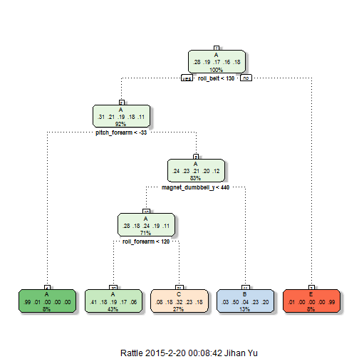

##**Practical Machine Learning Project**
## Type of Model
I use Tree model  
The goal of this project is to predict the manner of exercise, and the manner is assigned at the "classe" variable in the training set.  
"classe" variable is a categorical data which has 5 levels("A" to "E")  
So I think it is more suitable to use tree model to perform "multi-level" prediction.  

## Basic assignment  
- Assign working directory  
- Download the data files and read them in R program

```r
# Assigning the working directory
setwd("C:/Users/Jihan Yu/Desktop/Coursera/Data Sciences/08 Practical machine learning")
if(!file.exists("data")){  dir.create("data")  }

# Assigning Urls of data
fileUrl_training <- "https://d396qusza40orc.cloudfront.net/predmachlearn/pml-training.csv"
fileUrl_testing <- "https://d396qusza40orc.cloudfront.net/predmachlearn/pml-testing.csv"

# Save the data to local storage & load them in R
download.file(fileUrl_training, destfile="./data/pml-training.csv", method="curl")
```

```
## Warning: running command 'curl
## "https://d396qusza40orc.cloudfront.net/predmachlearn/pml-training.csv" -o
## "./data/pml-training.csv"' had status 127
```

```
## Warning in download.file(fileUrl_training, destfile =
## "./data/pml-training.csv", : download had nonzero exit status
```

```r
download.file(fileUrl_testing, destfile="./data/pml-testing.csv", method="curl")
```

```
## Warning: running command 'curl
## "https://d396qusza40orc.cloudfront.net/predmachlearn/pml-testing.csv" -o
## "./data/pml-testing.csv"' had status 127
```

```
## Warning in download.file(fileUrl_testing, destfile =
## "./data/pml-testing.csv", : download had nonzero exit status
```

```r
training <- read.csv("./data/pml-training.csv", header=TRUE, row.names=1)
testing <- read.csv("./data/pml-testing.csv", header=TRUE, row.names=1)
```

## Variable selection
The testing file("pml-testing.csv") has some variables which have missing values only(NA).  
They do not contribute to predict the result of testing dataset.  
So, I use sub-dataset which do not has missing values to train model.  
To do this, I extract the index numbers of variable which do not has missing values.  
And make new training dataset using original training set("pml-training.csv")  


```r
# In testing file(pml-testing.csv), variables containing missing values only has
#  "logical" class type, so identify the ids not having logical class type and use them
class_test <- sapply(testing, class)
var_id <- which(!(class_test=="logical"));  var_id <- var_id[-c(2:6)]

new_train <- training[,var_id]   # use same variables to train the model
```


## Split the dataset
I make the sub-datasets to train & test the model by spliting the training dataset("pml-training.csv").  
The test sub-dataset(subset of training dataset("pml-training.csv") not testing dataset of "pml-testing.csv") 
is for expecting the accuracy and error of the model


```r
library(caret)
```

```
## Loading required package: lattice
## Loading required package: ggplot2
```

```r
# Create training and testing set in the training file(pml-training.csv)
inTrain <- createDataPartition(y=new_train$classe, p=0.75, list=FALSE)
train_training <- new_train[inTrain,]
test_training <- new_train[-inTrain,]
dim(train_training);  dim(test_training)
```

```
## [1] 14718    54
```

```
## [1] 4904   54
```
There are 14718 data in training subset and 4904 data in test subset  


## Train tree model by method="rpart" & construct tree plot

```r
# Make tree model
modelFit <- train(classe~., data=train_training, method="rpart")
```

```
## Loading required package: rpart
```

```r
print(modelFit$finalModel)
```

```
## n= 14718 
## 
## node), split, n, loss, yval, (yprob)
##       * denotes terminal node
## 
##  1) root 14718 10533 A (0.28 0.19 0.17 0.16 0.18)  
##    2) roll_belt< 130.5 13485  9309 A (0.31 0.21 0.19 0.18 0.11)  
##      4) pitch_forearm< -33.05 1223    16 A (0.99 0.013 0 0 0) *
##      5) pitch_forearm>=-33.05 12262  9293 A (0.24 0.23 0.21 0.2 0.12)  
##       10) magnet_dumbbell_y< 439.5 10382  7470 A (0.28 0.18 0.24 0.19 0.11)  
##         20) roll_forearm< 119.5 6335  3742 A (0.41 0.18 0.19 0.17 0.06) *
##         21) roll_forearm>=119.5 4047  2737 C (0.079 0.18 0.32 0.23 0.18) *
##       11) magnet_dumbbell_y>=439.5 1880   935 B (0.03 0.5 0.043 0.23 0.2) *
##    3) roll_belt>=130.5 1233     9 E (0.0073 0 0 0 0.99) *
```

```r
# make tree plot
library(rattle)
```

```
## Rattle: A free graphical interface for data mining with R.
## Version 3.4.1 Copyright (c) 2006-2014 Togaware Pty Ltd.
## Type 'rattle()' to shake, rattle, and roll your data.
```

```r
fancyRpartPlot(modelFit$finalModel)
```

 
  
As the values of roll_belt, pitch_forearm, magnetic dumbell_y, and roll_forearm,  
classe can be differentiated as A, B, C and E.  


## Predicting the model result by test subset of training data("pml-training.csv") and make confusion Matrix to find accuracy

```r
# Predicting test sub-dataset in the training data
predict_test <- predict(modelFit, newdata=test_training)

confusionMatrix(predict_test, test_training$classe)
```

```
## Confusion Matrix and Statistics
## 
##           Reference
## Prediction    A    B    C    D    E
##          A 1262  364  405  360  144
##          B   24  341   28  138  118
##          C  104  244  422  306  232
##          D    0    0    0    0    0
##          E    5    0    0    0  407
## 
## Overall Statistics
##                                         
##                Accuracy : 0.4959        
##                  95% CI : (0.4818, 0.51)
##     No Information Rate : 0.2845        
##     P-Value [Acc > NIR] : < 2.2e-16     
##                                         
##                   Kappa : 0.3414        
##  Mcnemar's Test P-Value : NA            
## 
## Statistics by Class:
## 
##                      Class: A Class: B Class: C Class: D Class: E
## Sensitivity            0.9047  0.35933  0.49357   0.0000  0.45172
## Specificity            0.6372  0.92212  0.78118   1.0000  0.99875
## Pos Pred Value         0.4978  0.52542  0.32263      NaN  0.98786
## Neg Pred Value         0.9439  0.85711  0.87959   0.8361  0.89003
## Prevalence             0.2845  0.19352  0.17435   0.1639  0.18373
## Detection Rate         0.2573  0.06954  0.08605   0.0000  0.08299
## Detection Prevalence   0.5169  0.13234  0.26672   0.0000  0.08401
## Balanced Accuracy      0.7709  0.64072  0.63737   0.5000  0.72524
```
Accuracy of this model is 50.04% with p-value < 2.2e-16.  

## Predicting the result of test dataset("pml-testing.csv")

```r
# apply the model to testing data(pml-testing.csv)
#   and make the result files suitable for project submission
answers_test <- predict(modelFit, newdata=testing)

pml_write_files <- function(x){
  n = length(x)
  for(i in 1:n){
    filename = paste0("./data/problem_id_",i,".txt")
    write.table(x[i],file=filename,quote=FALSE,row.names=FALSE,col.names=FALSE)
  }
}

pml_write_files(answers_test)
```
The prediction result : C A C A A C C A A A C C C A C A A A A C  
